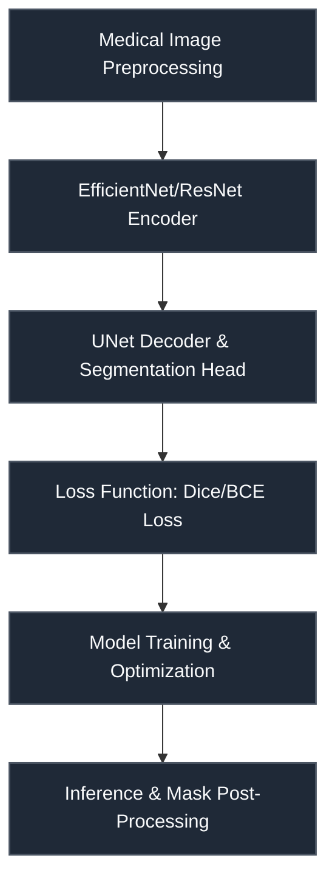

# CIBMTR — Equity in Post-HCT Survival Predictions

 

> **Host:** [`CIBMTR`]  
> **Platform Link:** [Kaggle Competition](https://www.kaggle.com/competitions/equity-post-HCT-survival-predictions)  
> **Dataset Link:** [Kaggle Dataset](https://www.kaggle.com/competitions/equity-post-HCT-survival-predictions/data)  
> **Domain:** `Healthcare & Survival Analysis`

## Overview

This repository contains the developmental workspace and notebooks for the **CIBMTR — Equity in Post-HCT Survival Predictions** project. The primary focus of this project is in the domain of **Healthcare & Survival Analysis** on CIBMTR. The codebase represents an iterative implementation of machine learning pipelines, structured to process datasets, train models, and validate predictions.

### Project Context

Models with Nelson-Aalen Target
.

### Technical Methodology & Implementation

The codebase features a total of 2996 cells across 181 notebook(s). The system implements several key architectural elements:
- **Core Classes**: Custom object-oriented structures are defined to manage state and logic, including: `CFG`, `EDA`, `ENCODER`, `EffnetModel`, `FE`, `MD`.
- **Key Algorithms & Utilities**: Procedural helpers and utilities facilitate operations, notably: `__init__`, `_plot_cv`, `_prepare_cv`, `_template`, `add_features`, `apply_fe`, `bar_chart`, `bubble_chart`.
- **Training & Optimization**: Includes optimization via Adam, cross-validation strategy for stable predictions.

## System Architecture

## Notebook Architecture

### Inference & Submission

| Notebook / Script | Type | Versions | Average Size | Core Stack / Techniques |
| :--- | :--- | :--- | :--- | :--- |
| **EfficientNet_LightGBM_LightGBM_XGBoost_XGBoost_CatBoost_SVM_CoxPH_Inference** | Multi-Version Script | [v1](./EfficientNet_LightGBM_LightGBM_XGBoost_XGBoost_CatBoost_SVM_CoxPH_Inference/v1.ipynb), [v2](./EfficientNet_LightGBM_LightGBM_XGBoost_XGBoost_CatBoost_SVM_CoxPH_Inference/v2.ipynb), [v3](./EfficientNet_LightGBM_LightGBM_XGBoost_XGBoost_CatBoost_SVM_CoxPH_Inference/v3.ipynb), [v4](./EfficientNet_LightGBM_LightGBM_XGBoost_XGBoost_CatBoost_SVM_CoxPH_Inference/v4.ipynb), [v5](./EfficientNet_LightGBM_LightGBM_XGBoost_XGBoost_CatBoost_SVM_CoxPH_Inference/v5.ipynb), [v6](./EfficientNet_LightGBM_LightGBM_XGBoost_XGBoost_CatBoost_SVM_CoxPH_Inference/v6.ipynb), [v7](./EfficientNet_LightGBM_LightGBM_XGBoost_XGBoost_CatBoost_SVM_CoxPH_Inference/v7.ipynb), [v8](./EfficientNet_LightGBM_LightGBM_XGBoost_XGBoost_CatBoost_SVM_CoxPH_Inference/v8.ipynb), [v9](./EfficientNet_LightGBM_LightGBM_XGBoost_XGBoost_CatBoost_SVM_CoxPH_Inference/v9.ipynb), [v10](./EfficientNet_LightGBM_LightGBM_XGBoost_XGBoost_CatBoost_SVM_CoxPH_Inference/v10.ipynb), [v11](./EfficientNet_LightGBM_LightGBM_XGBoost_XGBoost_CatBoost_SVM_CoxPH_Inference/v11.ipynb), [v12](./EfficientNet_LightGBM_LightGBM_XGBoost_XGBoost_CatBoost_SVM_CoxPH_Inference/v12.ipynb), [v13](./EfficientNet_LightGBM_LightGBM_XGBoost_XGBoost_CatBoost_SVM_CoxPH_Inference/v13.ipynb), [v14](./EfficientNet_LightGBM_LightGBM_XGBoost_XGBoost_CatBoost_SVM_CoxPH_Inference/v14.ipynb) | 250 KB | CatBoost, CoxPH Survival Analysis, LightGBM, OpenCV, PyTorch, Requests API, Scikit-Learn, XGBoost |
| **EfficientNet_ResNet_LightGBM_LightGBM_CatBoost_CoxPH_Inference** | Multi-Version Script | [v1](./EfficientNet_ResNet_LightGBM_LightGBM_CatBoost_CoxPH_Inference/v1.ipynb), [v2](./EfficientNet_ResNet_LightGBM_LightGBM_CatBoost_CoxPH_Inference/v2.ipynb), [v3](./EfficientNet_ResNet_LightGBM_LightGBM_CatBoost_CoxPH_Inference/v3.ipynb), [v4](./EfficientNet_ResNet_LightGBM_LightGBM_CatBoost_CoxPH_Inference/v4.ipynb), [v5](./EfficientNet_ResNet_LightGBM_LightGBM_CatBoost_CoxPH_Inference/v5.ipynb), [v6](./EfficientNet_ResNet_LightGBM_LightGBM_CatBoost_CoxPH_Inference/v6.ipynb), [v7](./EfficientNet_ResNet_LightGBM_LightGBM_CatBoost_CoxPH_Inference/v7.ipynb), [v8](./EfficientNet_ResNet_LightGBM_LightGBM_CatBoost_CoxPH_Inference/v8.ipynb), [v9](./EfficientNet_ResNet_LightGBM_LightGBM_CatBoost_CoxPH_Inference/v9.ipynb), [v10](./EfficientNet_ResNet_LightGBM_LightGBM_CatBoost_CoxPH_Inference/v10.ipynb), [v11](./EfficientNet_ResNet_LightGBM_LightGBM_CatBoost_CoxPH_Inference/v11.ipynb), [v12](./EfficientNet_ResNet_LightGBM_LightGBM_CatBoost_CoxPH_Inference/v12.ipynb), [v13](./EfficientNet_ResNet_LightGBM_LightGBM_CatBoost_CoxPH_Inference/v13.ipynb), [v14](./EfficientNet_ResNet_LightGBM_LightGBM_CatBoost_CoxPH_Inference/v14.ipynb), [v15](./EfficientNet_ResNet_LightGBM_LightGBM_CatBoost_CoxPH_Inference/v15.ipynb), [v16](./EfficientNet_ResNet_LightGBM_LightGBM_CatBoost_CoxPH_Inference/v16.ipynb), [v17](./EfficientNet_ResNet_LightGBM_LightGBM_CatBoost_CoxPH_Inference/v17.ipynb), [v18](./EfficientNet_ResNet_LightGBM_LightGBM_CatBoost_CoxPH_Inference/v18.ipynb), [v19](./EfficientNet_ResNet_LightGBM_LightGBM_CatBoost_CoxPH_Inference/v19.ipynb), [v20](./EfficientNet_ResNet_LightGBM_LightGBM_CatBoost_CoxPH_Inference/v20.ipynb), [v21](./EfficientNet_ResNet_LightGBM_LightGBM_CatBoost_CoxPH_Inference/v21.ipynb), [v22](./EfficientNet_ResNet_LightGBM_LightGBM_CatBoost_CoxPH_Inference/v22.ipynb), [v23](./EfficientNet_ResNet_LightGBM_LightGBM_CatBoost_CoxPH_Inference/v23.ipynb), [v24](./EfficientNet_ResNet_LightGBM_LightGBM_CatBoost_CoxPH_Inference/v24.ipynb), [v25](./EfficientNet_ResNet_LightGBM_LightGBM_CatBoost_CoxPH_Inference/v25.ipynb), [v26](./EfficientNet_ResNet_LightGBM_LightGBM_CatBoost_CoxPH_Inference/v26.ipynb), [v27](./EfficientNet_ResNet_LightGBM_LightGBM_CatBoost_CoxPH_Inference/v27.ipynb), [v28](./EfficientNet_ResNet_LightGBM_LightGBM_CatBoost_CoxPH_Inference/v28.ipynb), [v29](./EfficientNet_ResNet_LightGBM_LightGBM_CatBoost_CoxPH_Inference/v29.ipynb), [v30](./EfficientNet_ResNet_LightGBM_LightGBM_CatBoost_CoxPH_Inference/v30.ipynb), [v31](./EfficientNet_ResNet_LightGBM_LightGBM_CatBoost_CoxPH_Inference/v31.ipynb), [v32](./EfficientNet_ResNet_LightGBM_LightGBM_CatBoost_CoxPH_Inference/v32.ipynb), [v33](./EfficientNet_ResNet_LightGBM_LightGBM_CatBoost_CoxPH_Inference/v33.ipynb), [v34](./EfficientNet_ResNet_LightGBM_LightGBM_CatBoost_CoxPH_Inference/v34.ipynb), [v35](./EfficientNet_ResNet_LightGBM_LightGBM_CatBoost_CoxPH_Inference/v35.ipynb), [v36](./EfficientNet_ResNet_LightGBM_LightGBM_CatBoost_CoxPH_Inference/v36.ipynb), [v37](./EfficientNet_ResNet_LightGBM_LightGBM_CatBoost_CoxPH_Inference/v37.ipynb), [v38](./EfficientNet_ResNet_LightGBM_LightGBM_CatBoost_CoxPH_Inference/v38.ipynb), [v39](./EfficientNet_ResNet_LightGBM_LightGBM_CatBoost_CoxPH_Inference/v39.ipynb), [v40](./EfficientNet_ResNet_LightGBM_LightGBM_CatBoost_CoxPH_Inference/v40.ipynb), [v41](./EfficientNet_ResNet_LightGBM_LightGBM_CatBoost_CoxPH_Inference/v41.ipynb), [v42](./EfficientNet_ResNet_LightGBM_LightGBM_CatBoost_CoxPH_Inference/v42.ipynb), [v43](./EfficientNet_ResNet_LightGBM_LightGBM_CatBoost_CoxPH_Inference/v43.ipynb), [v44](./EfficientNet_ResNet_LightGBM_LightGBM_CatBoost_CoxPH_Inference/v44.ipynb), [v45](./EfficientNet_ResNet_LightGBM_LightGBM_CatBoost_CoxPH_Inference/v45.ipynb), [v46](./EfficientNet_ResNet_LightGBM_LightGBM_CatBoost_CoxPH_Inference/v46.ipynb), [v47](./EfficientNet_ResNet_LightGBM_LightGBM_CatBoost_CoxPH_Inference/v47.ipynb), [v48](./EfficientNet_ResNet_LightGBM_LightGBM_CatBoost_CoxPH_Inference/v48.ipynb), [v49](./EfficientNet_ResNet_LightGBM_LightGBM_CatBoost_CoxPH_Inference/v49.ipynb), [v50](./EfficientNet_ResNet_LightGBM_LightGBM_CatBoost_CoxPH_Inference/v50.ipynb), [v51](./EfficientNet_ResNet_LightGBM_LightGBM_CatBoost_CoxPH_Inference/v51.ipynb), [v52](./EfficientNet_ResNet_LightGBM_LightGBM_CatBoost_CoxPH_Inference/v52.ipynb), [v53](./EfficientNet_ResNet_LightGBM_LightGBM_CatBoost_CoxPH_Inference/v53.ipynb), [v54](./EfficientNet_ResNet_LightGBM_LightGBM_CatBoost_CoxPH_Inference/v54.ipynb), [v55](./EfficientNet_ResNet_LightGBM_LightGBM_CatBoost_CoxPH_Inference/v55.ipynb) | 784 KB | CatBoost, CoxPH Survival Analysis, LightGBM, OpenCV, PyTorch, Scikit-Learn |
| **LightGBM_CatBoost_Inference** | Multi-Version Script | [v1](./LightGBM_CatBoost_Inference/v1.ipynb), [v2](./LightGBM_CatBoost_Inference/v2.ipynb) | 20 KB | CatBoost, PyTorch, Requests API, Scikit-Learn |
| [LightGBM_LightGBM_CatBoost_CoxPH_Inference](./escaped_item) | Single Notebook | v1 | 119 KB | CatBoost, CoxPH Survival Analysis, LightGBM, Scikit-Learn |
| **LightGBM_LightGBM_CatBoost_CoxPH_Inference_2** | Multi-Version Script | [v1](./LightGBM_LightGBM_CatBoost_CoxPH_Inference_2/v1.ipynb), [v2](./LightGBM_LightGBM_CatBoost_CoxPH_Inference_2/v2.ipynb), [v3](./LightGBM_LightGBM_CatBoost_CoxPH_Inference_2/v3.ipynb) | 103 KB | CatBoost, CoxPH Survival Analysis, LightGBM, Scikit-Learn |
| **LightGBM_LightGBM_CatBoost_CoxPH_Inference_3** | Multi-Version Script | [v1](./LightGBM_LightGBM_CatBoost_CoxPH_Inference_3/v1.ipynb), [v2](./LightGBM_LightGBM_CatBoost_CoxPH_Inference_3/v2.ipynb), [v3](./LightGBM_LightGBM_CatBoost_CoxPH_Inference_3/v3.ipynb), [v4](./LightGBM_LightGBM_CatBoost_CoxPH_Inference_3/v4.ipynb), [v5](./LightGBM_LightGBM_CatBoost_CoxPH_Inference_3/v5.ipynb), [v6](./LightGBM_LightGBM_CatBoost_CoxPH_Inference_3/v6.ipynb), [v7](./LightGBM_LightGBM_CatBoost_CoxPH_Inference_3/v7.ipynb), [v8](./LightGBM_LightGBM_CatBoost_CoxPH_Inference_3/v8.ipynb) | 129 KB | CatBoost, CoxPH Survival Analysis, LightGBM, Scikit-Learn |
| **LightGBM_LightGBM_XGBoost_XGBoost_CatBoost_SVM_CoxPH_Inference** | Multi-Version Script | [v1](./LightGBM_LightGBM_XGBoost_XGBoost_CatBoost_SVM_CoxPH_Inference/v1.ipynb), [v2](./LightGBM_LightGBM_XGBoost_XGBoost_CatBoost_SVM_CoxPH_Inference/v2.ipynb), [v3](./LightGBM_LightGBM_XGBoost_XGBoost_CatBoost_SVM_CoxPH_Inference/v3.ipynb), [v4](./LightGBM_LightGBM_XGBoost_XGBoost_CatBoost_SVM_CoxPH_Inference/v4.ipynb), [v5](./LightGBM_LightGBM_XGBoost_XGBoost_CatBoost_SVM_CoxPH_Inference/v5.ipynb), [v6](./LightGBM_LightGBM_XGBoost_XGBoost_CatBoost_SVM_CoxPH_Inference/v6.ipynb), [v7](./LightGBM_LightGBM_XGBoost_XGBoost_CatBoost_SVM_CoxPH_Inference/v7.ipynb), [v8](./LightGBM_LightGBM_XGBoost_XGBoost_CatBoost_SVM_CoxPH_Inference/v8.ipynb), [v9](./LightGBM_LightGBM_XGBoost_XGBoost_CatBoost_SVM_CoxPH_Inference/v9.ipynb), [v10](./LightGBM_LightGBM_XGBoost_XGBoost_CatBoost_SVM_CoxPH_Inference/v10.ipynb), [v11](./LightGBM_LightGBM_XGBoost_XGBoost_CatBoost_SVM_CoxPH_Inference/v11.ipynb), [v12](./LightGBM_LightGBM_XGBoost_XGBoost_CatBoost_SVM_CoxPH_Inference/v12.ipynb), [v13](./LightGBM_LightGBM_XGBoost_XGBoost_CatBoost_SVM_CoxPH_Inference/v13.ipynb), [v14](./LightGBM_LightGBM_XGBoost_XGBoost_CatBoost_SVM_CoxPH_Inference/v14.ipynb), [v15](./LightGBM_LightGBM_XGBoost_XGBoost_CatBoost_SVM_CoxPH_Inference/v15.ipynb), [v16](./LightGBM_LightGBM_XGBoost_XGBoost_CatBoost_SVM_CoxPH_Inference/v16.ipynb), [v17](./LightGBM_LightGBM_XGBoost_XGBoost_CatBoost_SVM_CoxPH_Inference/v17.ipynb), [v18](./LightGBM_LightGBM_XGBoost_XGBoost_CatBoost_SVM_CoxPH_Inference/v18.ipynb), [v19](./LightGBM_LightGBM_XGBoost_XGBoost_CatBoost_SVM_CoxPH_Inference/v19.ipynb), [v20](./LightGBM_LightGBM_XGBoost_XGBoost_CatBoost_SVM_CoxPH_Inference/v20.ipynb), [v21](./LightGBM_LightGBM_XGBoost_XGBoost_CatBoost_SVM_CoxPH_Inference/v21.ipynb), [v22](./LightGBM_LightGBM_XGBoost_XGBoost_CatBoost_SVM_CoxPH_Inference/v22.ipynb), [v23](./LightGBM_LightGBM_XGBoost_XGBoost_CatBoost_SVM_CoxPH_Inference/v23.ipynb), [v24](./LightGBM_LightGBM_XGBoost_XGBoost_CatBoost_SVM_CoxPH_Inference/v24.ipynb), [v25](./LightGBM_LightGBM_XGBoost_XGBoost_CatBoost_SVM_CoxPH_Inference/v25.ipynb), [v26](./LightGBM_LightGBM_XGBoost_XGBoost_CatBoost_SVM_CoxPH_Inference/v26.ipynb), [v27](./LightGBM_LightGBM_XGBoost_XGBoost_CatBoost_SVM_CoxPH_Inference/v27.ipynb), [v28](./LightGBM_LightGBM_XGBoost_XGBoost_CatBoost_SVM_CoxPH_Inference/v28.ipynb), [v29](./LightGBM_LightGBM_XGBoost_XGBoost_CatBoost_SVM_CoxPH_Inference/v29.ipynb), [v30](./LightGBM_LightGBM_XGBoost_XGBoost_CatBoost_SVM_CoxPH_Inference/v30.ipynb), [v31](./LightGBM_LightGBM_XGBoost_XGBoost_CatBoost_SVM_CoxPH_Inference/v31.ipynb), [v32](./LightGBM_LightGBM_XGBoost_XGBoost_CatBoost_SVM_CoxPH_Inference/v32.ipynb), [v33](./LightGBM_LightGBM_XGBoost_XGBoost_CatBoost_SVM_CoxPH_Inference/v33.ipynb), [v34](./LightGBM_LightGBM_XGBoost_XGBoost_CatBoost_SVM_CoxPH_Inference/v34.ipynb), [v35](./LightGBM_LightGBM_XGBoost_XGBoost_CatBoost_SVM_CoxPH_Inference/v35.ipynb), [v36](./LightGBM_LightGBM_XGBoost_XGBoost_CatBoost_SVM_CoxPH_Inference/v36.ipynb), [v37](./LightGBM_LightGBM_XGBoost_XGBoost_CatBoost_SVM_CoxPH_Inference/v37.ipynb), [v38](./LightGBM_LightGBM_XGBoost_XGBoost_CatBoost_SVM_CoxPH_Inference/v38.ipynb), [v39](./LightGBM_LightGBM_XGBoost_XGBoost_CatBoost_SVM_CoxPH_Inference/v39.ipynb), [v40](./LightGBM_LightGBM_XGBoost_XGBoost_CatBoost_SVM_CoxPH_Inference/v40.ipynb), [v41](./LightGBM_LightGBM_XGBoost_XGBoost_CatBoost_SVM_CoxPH_Inference/v41.ipynb), [v42](./LightGBM_LightGBM_XGBoost_XGBoost_CatBoost_SVM_CoxPH_Inference/v42.ipynb), [v43](./LightGBM_LightGBM_XGBoost_XGBoost_CatBoost_SVM_CoxPH_Inference/v43.ipynb), [v44](./LightGBM_LightGBM_XGBoost_XGBoost_CatBoost_SVM_CoxPH_Inference/v44.ipynb), [v45](./LightGBM_LightGBM_XGBoost_XGBoost_CatBoost_SVM_CoxPH_Inference/v45.ipynb), [v46](./LightGBM_LightGBM_XGBoost_XGBoost_CatBoost_SVM_CoxPH_Inference/v46.ipynb), [v47](./LightGBM_LightGBM_XGBoost_XGBoost_CatBoost_SVM_CoxPH_Inference/v47.ipynb), [v48](./LightGBM_LightGBM_XGBoost_XGBoost_CatBoost_SVM_CoxPH_Inference/v48.ipynb), [v49](./LightGBM_LightGBM_XGBoost_XGBoost_CatBoost_SVM_CoxPH_Inference/v49.ipynb), [v50](./LightGBM_LightGBM_XGBoost_XGBoost_CatBoost_SVM_CoxPH_Inference/v50.ipynb), [v51](./LightGBM_LightGBM_XGBoost_XGBoost_CatBoost_SVM_CoxPH_Inference/v51.ipynb), [v52](./LightGBM_LightGBM_XGBoost_XGBoost_CatBoost_SVM_CoxPH_Inference/v52.ipynb), [v53](./LightGBM_LightGBM_XGBoost_XGBoost_CatBoost_SVM_CoxPH_Inference/v53.ipynb), [v54](./LightGBM_LightGBM_XGBoost_XGBoost_CatBoost_SVM_CoxPH_Inference/v54.ipynb), [v55](./LightGBM_LightGBM_XGBoost_XGBoost_CatBoost_SVM_CoxPH_Inference/v55.ipynb), [v56](./LightGBM_LightGBM_XGBoost_XGBoost_CatBoost_SVM_CoxPH_Inference/v56.ipynb), [v57](./LightGBM_LightGBM_XGBoost_XGBoost_CatBoost_SVM_CoxPH_Inference/v57.ipynb), [v58](./LightGBM_LightGBM_XGBoost_XGBoost_CatBoost_SVM_CoxPH_Inference/v58.ipynb), [v59](./LightGBM_LightGBM_XGBoost_XGBoost_CatBoost_SVM_CoxPH_Inference/v59.ipynb), [v60](./LightGBM_LightGBM_XGBoost_XGBoost_CatBoost_SVM_CoxPH_Inference/v60.ipynb), [v61](./LightGBM_LightGBM_XGBoost_XGBoost_CatBoost_SVM_CoxPH_Inference/v61.ipynb), [v62](./LightGBM_LightGBM_XGBoost_XGBoost_CatBoost_SVM_CoxPH_Inference/v62.ipynb), [v63](./LightGBM_LightGBM_XGBoost_XGBoost_CatBoost_SVM_CoxPH_Inference/v63.ipynb), [v64](./LightGBM_LightGBM_XGBoost_XGBoost_CatBoost_SVM_CoxPH_Inference/v64.ipynb), [v65](./LightGBM_LightGBM_XGBoost_XGBoost_CatBoost_SVM_CoxPH_Inference/v65.ipynb), [v66](./LightGBM_LightGBM_XGBoost_XGBoost_CatBoost_SVM_CoxPH_Inference/v66.ipynb), [v67](./LightGBM_LightGBM_XGBoost_XGBoost_CatBoost_SVM_CoxPH_Inference/v67.ipynb), [v68](./LightGBM_LightGBM_XGBoost_XGBoost_CatBoost_SVM_CoxPH_Inference/v68.ipynb), [v69](./LightGBM_LightGBM_XGBoost_XGBoost_CatBoost_SVM_CoxPH_Inference/v69.ipynb), [v70](./LightGBM_LightGBM_XGBoost_XGBoost_CatBoost_SVM_CoxPH_Inference/v70.ipynb), [v71](./LightGBM_LightGBM_XGBoost_XGBoost_CatBoost_SVM_CoxPH_Inference/v71.ipynb), [v72](./LightGBM_LightGBM_XGBoost_XGBoost_CatBoost_SVM_CoxPH_Inference/v72.ipynb), [v73](./LightGBM_LightGBM_XGBoost_XGBoost_CatBoost_SVM_CoxPH_Inference/v73.ipynb), [v74](./LightGBM_LightGBM_XGBoost_XGBoost_CatBoost_SVM_CoxPH_Inference/v74.ipynb), [v75](./LightGBM_LightGBM_XGBoost_XGBoost_CatBoost_SVM_CoxPH_Inference/v75.ipynb), [v76](./LightGBM_LightGBM_XGBoost_XGBoost_CatBoost_SVM_CoxPH_Inference/v76.ipynb), [v77](./LightGBM_LightGBM_XGBoost_XGBoost_CatBoost_SVM_CoxPH_Inference/v77.ipynb), [v78](./LightGBM_LightGBM_XGBoost_XGBoost_CatBoost_SVM_CoxPH_Inference/v78.ipynb), [v79](./LightGBM_LightGBM_XGBoost_XGBoost_CatBoost_SVM_CoxPH_Inference/v79.ipynb), [v80](./LightGBM_LightGBM_XGBoost_XGBoost_CatBoost_SVM_CoxPH_Inference/v80.ipynb), [v81](./LightGBM_LightGBM_XGBoost_XGBoost_CatBoost_SVM_CoxPH_Inference/v81.ipynb), [v82](./LightGBM_LightGBM_XGBoost_XGBoost_CatBoost_SVM_CoxPH_Inference/v82.ipynb), [v83](./LightGBM_LightGBM_XGBoost_XGBoost_CatBoost_SVM_CoxPH_Inference/v83.ipynb), [v84](./LightGBM_LightGBM_XGBoost_XGBoost_CatBoost_SVM_CoxPH_Inference/v84.ipynb), [v85](./LightGBM_LightGBM_XGBoost_XGBoost_CatBoost_SVM_CoxPH_Inference/v85.ipynb), [v86](./LightGBM_LightGBM_XGBoost_XGBoost_CatBoost_SVM_CoxPH_Inference/v86.ipynb), [v87](./LightGBM_LightGBM_XGBoost_XGBoost_CatBoost_SVM_CoxPH_Inference/v87.ipynb), [v88](./LightGBM_LightGBM_XGBoost_XGBoost_CatBoost_SVM_CoxPH_Inference/v88.ipynb), [v89](./LightGBM_LightGBM_XGBoost_XGBoost_CatBoost_SVM_CoxPH_Inference/v89.ipynb), [v90](./LightGBM_LightGBM_XGBoost_XGBoost_CatBoost_SVM_CoxPH_Inference/v90.ipynb), [v91](./LightGBM_LightGBM_XGBoost_XGBoost_CatBoost_SVM_CoxPH_Inference/v91.ipynb), [v92](./LightGBM_LightGBM_XGBoost_XGBoost_CatBoost_SVM_CoxPH_Inference/v92.ipynb), [v93](./LightGBM_LightGBM_XGBoost_XGBoost_CatBoost_SVM_CoxPH_Inference/v93.ipynb) | 38 KB | CatBoost, CoxPH Survival Analysis, LightGBM, Requests API, Scikit-Learn, TensorFlow/Keras, XGBoost |
| **SVM_Inference** | Multi-Version Script | [v1](./SVM_Inference/v1.ipynb), [v2](./SVM_Inference/v2.ipynb), [v3](./SVM_Inference/v3.ipynb), [v4](./SVM_Inference/v4.ipynb), [v5](./SVM_Inference/v5.ipynb) | 23 KB | Requests API, Scikit-Learn |

## Navigation Guidelines

> **Stage Guidelines**
>
- **EDA & Preprocessing**: Verify data loaders and inspect class distributions before model design.
- **Training & Validation**: Check training runs, loss curves, and model validation scores to evaluate performance.
- **Inference & Ensembling**: Run predictions on testing files and verify submission formatting.

---

> "We measure survival in days and statistics, writing equations for the inevitable."
>
> — **Vigneshwaran S**
